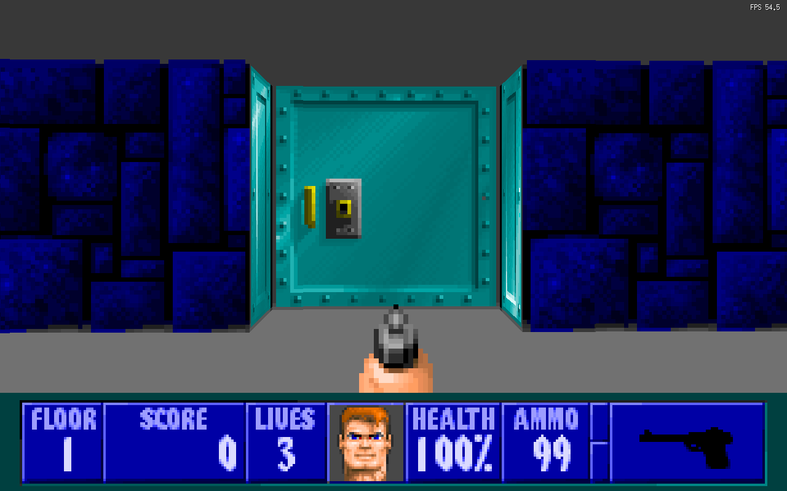

# GD-WOLF

[](https://github.com/Distortions81/GD-WOLF/releases/latest)
[](https://github.com/Distortions81/GD-WOLF/blob/main/LICENSE)

`GD-WOLF` is a Go/Ebiten Wolfenstein 3D port focused on gameplay parity with the original game while also adding a few modern conveniences for native and browser builds.

## Screenshot



## Current Status

The project currently includes:

- Wolfenstein 3D-style software raycast rendering and HUD/status bar presentation
- native and wasm builds
- native TOML config persistence for volume and input settings
- weapon pickups and map/loadout flow aligned more closely with Wolfenstein 3D
- pause/options menus, cheats, secret push walls, elevators, and level transitions
- gameplay flashes and a much closer Wolfenstein 3D death sequence
- native stereo positional sound, with simplified wasm audio
- actor collision and timing work updated to use Wolf-style tics instead of assuming a fixed render/update rate

Implementation is still incomplete. Enemy parity work is tracked in [docs/enemy-parity.md](/home/dist/github/GD-WOLF/docs/enemy-parity.md).

## Project Additions Beyond Wolfenstein 3D

Alongside parity work, this port also includes some modern extras that are outside the original Wolfenstein 3D scope:

- selectable `DOS`, `HQ`, and `ULTRA` render modes, plus VSync control
- persistent native config storage for input/audio/render settings
- save slot previews with embedded thumbnails, plus browser save persistence on wasm
- a textured map-view mode for inspecting levels outside the original presentation

## Intentional Gameplay Deviations

Some behaviors still intentionally diverge from Wolfenstein 3D for feel or clarity.

### Doors

- Door collision uses a thinner center slab than the original tile-solid behavior.
- The player does not slide along that door slab when pushing diagonally into it.

These are deliberate quality-of-life changes to make doors feel less cumbersome and less visually confusing.

## Known Differences From Full Wolfenstein 3D Parity

- The project does not yet implement the full original enemy roster and behaviors.
- Some systems are Wolfenstein 3D-inspired rather than byte-faithful, especially presentation details around fades, flashes, and frontend behavior.

## Data

The project expects original Wolfenstein 3D v1.4-era data layouts. Older Wolf revisions are not supported.

The repo already includes the canonical shareware `WL1` v1.4 data under [internal/wl6/shareware](/home/dist/github/GD-WOLF/internal/wl6/shareware). For registered/full data, use matching `WL6` v1.4 files.

When digitized sounds are present in the data files, they are preferred over synthesized fallback effects.

If no local data directory is found, the runtime falls back to embedded shareware assets. That fallback also powers the browser build.

For local native runs, optional runtime PNG replacements can be placed under [hd-assets](/home/dist/github/GD-WOLF/hd-assets/README.md). Matching filenames override decoded pictures, sprites, and wall textures without changing the underlying game data files.

## Browser Build

`GD-WOLF` also has a browser build. To build it locally:

```bash
./scripts/build_wasm.sh
```

The script writes fresh browser assets, including `gdwolf.wasm.gz`, into `build/wasm`. It requires:

- `wasm_exec.js` from your local Go toolchain
- optional `wasm-opt` on `PATH` for automatic optimization (`-O4` by default, override with `WASM_OPT_LEVEL`)

To serve the build locally:

```bash
go run ./cmd/wasmserve
```

By default `cmd/wasmserve` serves the current directory if it already contains the built app; otherwise it falls back to `build/wasm` and listens on `:8000`.
