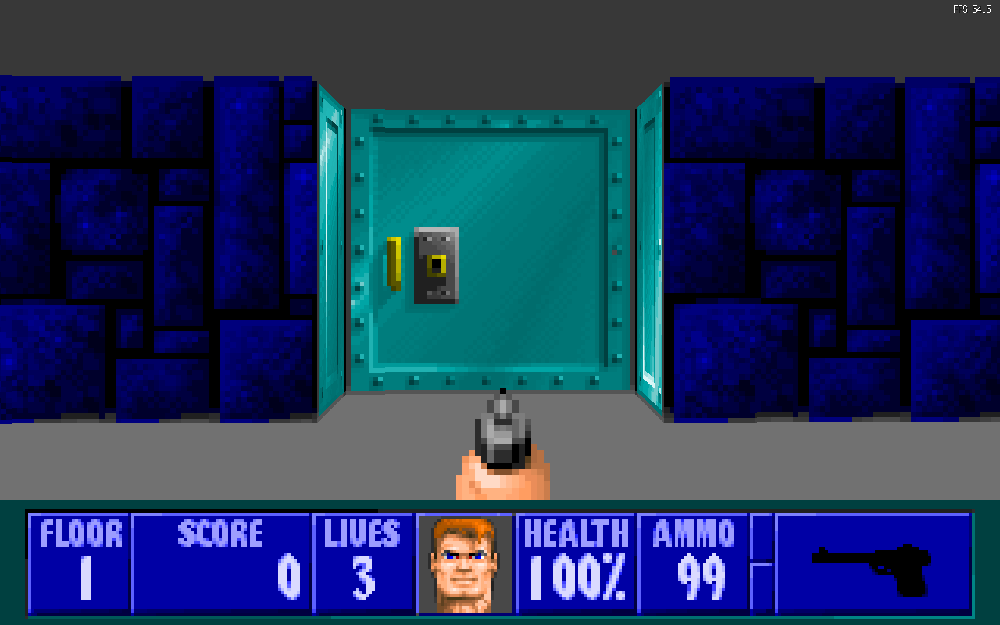

# GD-WOLF

`GD-WOLF` is a Go/Ebiten Wolfenstein 3D port focused on gameplay parity with the original game while also adding a few modern conveniences for native and browser builds.

[PLAY IN BROWSER NOW](https://m45sci.xyz/u/dist/GD-WOLF/)

## Screenshot



## Current Status

The project currently includes:

- Wolfenstein 3D-style CPU ray casting with GPU-accelerated classic pixel rendering and a software fallback
- native and wasm builds
- native TOML config persistence for volume and input settings
- weapon pickups and map/loadout flow aligned more closely with Wolfenstein 3D
- pause/options menus, cheats, secret push walls, elevators, and level transitions
- gameplay flashes and a much closer Wolfenstein 3D death sequence
- native stereo positional sound, with simplified wasm audio
- actor collision and timing work updated to use Wolf-style tics instead of assuming a fixed render/update rate

All Wolf3D enemy families are implemented, with bounded original-source checks.
Complete gameplay and presentation parity remains unverified.
Implementation and verification coverage is tracked in
[enemy-parity.md](enemy-parity.md).

### Enemy AI Verification

The 2026-10-03 original-source audit matched **894,444 isolated movement
decisions**, with zero differences after fixing fallback direction selection,
blocked movement and humanoid locked-door handling. The reference compiles
the original C `TryWalk`, `SelectChaseDir`, `SelectDodgeDir`, and `SelectRunDir`
routines and compares them with the port on map snapshots and local obstruction
cases. Actor classes in this comparison are normalized to humanoid or dog.
An additional registered-data scan matched 15,024 isolated original-C decisions
across all 60 maps. A broader Go source-rule adapter matched 30,036 sampled
sight, attack-entry, movement and runtime checks on those maps.

This result verifies the tested movement decisions. It does not establish
complete AI parity over time: sight and hearing, state timing, attacks, damage,
and interactions across the full roster and map set still need independent
original-engine comparison. Go regressions cover some of these behaviors, but the broader AI
harness uses a Go reference adapter rather than the original engine. Recorded
demo playback and a source runtime comparison are now available. The runtime
reference matches all four shareware and all four Apogee registered demos,
including inventory, lives, level counters, actor state and terminal death.
Original x86 raycasting audits the floor masks. The shipped DOS executable
separately confirms health/ammo and the death endpoint for the first shareware
demo. A 152-case original-C pickup probe covers inventory limits, score rewards
and weapon changes during attacks. A deterministic sound scheduler now matches
original-C priority, expiry and face RNG, including a registered demo where
omitted sound suppression changed a 51-kill death into a 23-kill survival.
Four native third-party recordings from The Way ID Did also pass with their
matching maps. Together with eight alternate-fire routes, the 20-run corpus
matches 19,091 commands and 78,196,736 original-x86 floor bits.
All Wolf3D enemy families and projectiles now have gameplay implementations and
bounded original-C encounter checks. BJ victory, boss death cameras and actor
occupancy are also compared. The expanded 432-case corpus passes with zero
observed desyncs under the verified registered DOS memory profile: 172,560 input
commands and 706,805,760 original-x86 floor bits, including generated routes
across all 60 maps and three sound modes for the stock/third-party corpus.
Physical audio timing, audible mixing and untested input sequences remain
unverified.
See [demo comparison coverage](docs/wolf-demo-compare.md).

Run the four built-in recordings plus four alternate-fire routes with local
registered data:

```bash
python3 scripts/wolf_demo_corpus_compare.py --data /path/to/WL6-files --sound-mode adlib-digi
```

The default sound mode is `adlib-digi`; `off` and `adlib` are also supported.
The corpus runner accepts a checksummed manifest of external recordings;
individual recordings use `scripts/wolf_demo_runtime_compare.sh --data /path/to/WL6-files --demo-file /path/to/demo.wl6`.
See the [third-party corpus guide](docs/wolf-third-party-demos.md) for the
verified four-demo TWIId corpus, exact asset hashes and importer commands.

## Project Additions Beyond Wolfenstein 3D

Alongside parity work, this port also includes some modern extras that are outside the original Wolfenstein 3D scope:

- selectable `DOS`, `HQ`, and `ULTRA` render modes, plus VSync control
- persistent native config storage for input/audio/render settings
- save slot previews with embedded thumbnails, plus browser save persistence on wasm
- a textured map-view mode for inspecting levels outside the original presentation

## Intentional Gameplay Deviations

Some behaviors still intentionally diverge from Wolfenstein 3D for feel or clarity.

### Doors

`Options > Modern Doors` enables a thinner center collision slab and prevents
sliding along it when pushing diagonally into a door. It defaults to On for
interactive play. Turn it Off for the original solid door tile and sliding rules.

The native setting is stored as `modern_doors` under `[gameplay]` in
`config.toml`. Demo playback always uses the original door rules, regardless
of this preference, and preserves the saved setting.

## Known Differences From Full Wolfenstein 3D Parity

- The project does not yet implement the full original enemy roster and behaviors.
- Complete enemy AI parity is unverified; the original-source runtime harness matches all four recorded shareware demos, all four recorded Apogee registered demos and four TWIId mod recordings. These routes do not cover every path through the six episodes.
- The separate demo player movement harness shares the port's world snapshots with its C reference. The runtime harness independently evolves actors, combat, doors, pickups and gameplay sound state, with visible-floor masks audited against original x86 code.
- Demo sound comparisons use two service steps per Wolf tic. Physical DOS interrupt phase, digitized playback duration and audible sample mixing remain unverified.
- Some systems are Wolfenstein 3D-inspired rather than byte-faithful, especially presentation details around fades, flashes, and frontend behavior.

## Data

The project expects original Wolfenstein 3D v1.4-era data layouts. Older Wolf revisions are not supported.

The repo already includes the canonical shareware `WL1` v1.4 data under [internal/wl6/shareware](/home/dist/github/GD-WOLF/internal/wl6/shareware). For registered/full data, use matching `WL6` v1.4 files. The Apogee six-episode release uses a different graphics chunk layout from the pinned registered source headers; the loader detects both layouts. Run it with `go run . -data /path/to/WL6-files`.

When digitized sounds are present in the data files, they are preferred over synthesized fallback effects.

If no local data directory is found, the runtime falls back to embedded shareware assets. That fallback also powers the browser build.

For local native runs, optional runtime PNG replacements can be placed under [hd-assets](/home/dist/github/GD-WOLF/hd-assets/README.md). Matching filenames override decoded pictures, sprites, and wall textures without changing the underlying game data files.

## Build and Test

Build the native game and run the Go tests with:

```bash
go build -o gd-wolf .
go test ./...
```

Go resolves the pinned dependencies from `go.mod`. The palette test uses the embedded fixture included in this repo.

On headless Linux, run the tests under a virtual display with `xvfb-run -a go test ./...` so Ebiten can initialize.

Browser save import/export regression tests use Node.js 22 or later:

```bash
node web/wasm/save-actions.test.cjs
```

Compare movement decisions against compiled original Wolf3D C routines with:

```bash
./scripts/wolf_source_compare.sh
```

See [the original-source harness](docs/wolf-source-compare.md) for source setup,
trace artifacts, replay, and its coverage limits. This command checks isolated
movement decisions, not a full gameplay demo. The existing broader
[AI harness](docs/enemy-ai-harness.md) uses a Go reference adapter.

## Demo Playback and Comparison

Play the first built-in demo from the bundled shareware data:

```bash
go run . -data internal/wl6/shareware -demo-index 0
```

Indices 0–3 select the four built-in demos. To play a recorded demo file using
the selected game data, use `-demo-file /path/to/demo.wl1`. Playback ends when
the input finishes or the port reaches death, victory or an elevator exit.
`-demo-sound-mode adlib-digi` is the default; `off` and `adlib` select the other
supported sound routes. Sound mode can affect face RNG and the resulting demo.

Compare recorded player movement with compiled original C:

```bash
./scripts/wolf_demo_player_compare.sh --stop-after-commands 1055
```

The first demo's first 1,055 commands (4,220 Wolf tics) match within this
conditional player-movement comparison. The unrestricted run stops at port
death before command 1,055. The broader original-C runtime comparison also
passes through the matching original death after command 1,054. The bundled DOS
executable also dies at tic 4,220, with 0 health and 41 ammo; it leaves the last
97 recorded commands unread. Health/ammo match DOS after every played command,
and original x86 raycasting matches all 4,321,280 floor-visibility bits.
See [demo comparison coverage and artifacts](docs/wolf-demo-compare.md).

Actor initialization on all four demo maps and conditional face-animation RNG
updates also match compiled original C:

```bash
./scripts/wolf_demo_start_compare.sh
```

Compare actor state timing and the first-demo runtime with compiled original C:

```bash
./scripts/wolf_actor_states_compare.sh
./scripts/wolf_demo_runtime_compare.sh
```

The state timing and first-demo runtime comparisons pass. The runtime script
also runs original-C projection, pickup, elevator and sound probes, and executes
the original 16-bit raycaster under QEMU. `--sound-mode off|adlib|adlib-digi`
selects the reference sound mode (default `adlib-digi`). Matching original death
or elevator exit is a supported endpoint; a differing terminal state fails.
Original sound routines and C service models verify gameplay sound state;
audio assembly and physical audio hardware are not executed.

Optionally repeat the shipped DOS executable check (Linux, DOSBox, about two minutes):

```bash
./scripts/wolf_demo_dos_compare.sh
```

## Browser Build

`GD-WOLF` also has a browser build. To build it locally:

```bash
./scripts/build_wasm.sh
```

The script writes fresh browser assets, including `gdwolf.wasm.gz`, into `build/wasm`. It requires:

- `wasm_exec.js` from your local Go toolchain
- optional `wasm-opt` on `PATH` for automatic optimization (`-O4` by default, override with `WASM_OPT_LEVEL`)

To serve the build locally:

```bash
go run ./cmd/wasmserve
```

By default `cmd/wasmserve` serves the current directory if it already contains the built app; otherwise it falls back to `build/wasm` and listens on `:8000`.
